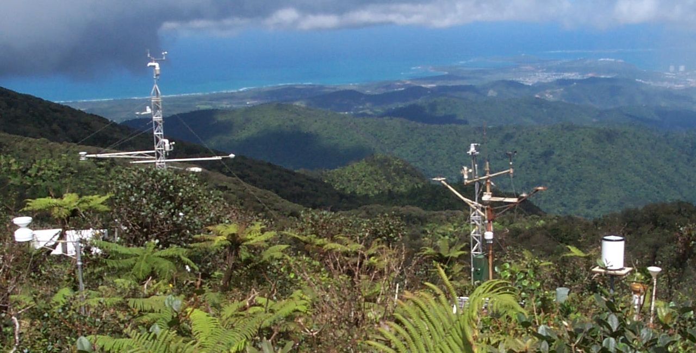

# Investigating the Impacts of Hurricane Hugo on Stream Chemistry at the Luquillo Long Term Ecological Research Site

Using data from the Long Term Ecological Research Network on stream chemistries in the Luquillo Experimental Forest in Puerto Rico, we set out to investigate the impacts of Hurricane Hugo.

# Table of contents {#table-of-contents}

-   [Table of contents](#table-of-contents)
-   [Installation](#installation)
-   [Acknowledgements](#contribute)
    -   [Authors](#sponsor)
    -   [Resources](#adding-new-features-or-fixing-bugs)

# Installation {#installation}

[(Back to top)](#table-of-contents)

````{=html}
<!-- 
To reproduce or build on our work, you can go to our github repo to fork it and make a clone. You use the terminal commands below or simply visit: https://github.com/reedalexandria/EDS214_Group_Project

```git init```
```git clone https://github.com/reedalexandria/EDS214_Group_Project``` -->
````

# Usage {#usage}

[(Back to top)](#table-of-contents)

<!-- This is optional and it is used to give the user info on how to use the project after installation. This could be added in the Installation section also. -->

# Acknowledgements

[(Back to top)](#table-of-contents)

```{=html}
<!-- This project was produced by students of the Master of Environmental Data Science program in the Bren School of Environmental Science & Management at University of Califronai, Santa Barbara. -->
```
### Authors {#Authors}

[(Back to top)](#table-of-contents)

```{=html}
<!-- Coding, design, and analytical work was done by:
<U/L>
<L/I> Alexandria Reed
<L/I> Erica Bishop
<L/I> Ruth Enriquez
<L/I> Gabrielle Smith
</UL>

 -->
```
### Resources {#sponsor}

[(Back to top)](#table-of-contents)

```{=html}
<!-- 
Data were pulled from:

McDowell, W. 2022. Chemistry of stream water from the Luquillo Mountains ver 4923058. Environmental Data Initiative. https://doi.org/10.6073/pasta/1dd1a59a7e6fbe95fdf8736477d81b83

You can find more infomormation about the Luquillo site and the Long Term Ecological Research Network at https://lternet.edu/site/luquillo-lter/. 
-->
```
